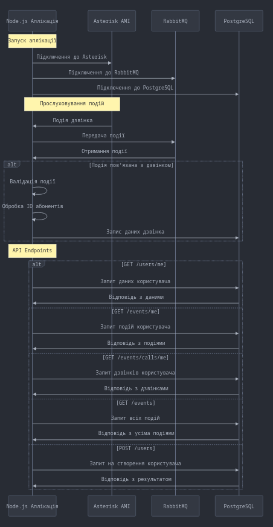

# StreamTelecomTestTask

---
## Опис 
### Процес роботи сервісів
1. Підключення до сервісів при запуску
   1. Встановлення з'єднання з RabbitMQ
   2. Встановлення з'єднання з Asterisk AMI
   3. Встановлення з'єднання з PostgreSQL
2. Обробка подій Asterisk
   1. Прослуховування подій через Asterisk AMI
   2. Фільтрація подій дзвінків
3. Обмін повідомленнями через RabbitMQ
   1. Передача події від Asterisk до черги RabbitMQ
   2. Отримання повідомлень з RabbitMQ для обробки
4. Обробка подій дзвінків
   1. Валідація події на належність до дзвінка
   2. Витягування ID абонентів (хто дзвонить і кому дзвонять)
   3. Збереження даних в PostgreSQL

### Ендпоінти
#### `GET` `/users/me` - Отримання даних авторизованого користувача (підтримує `startDate`, `endDate`)
#### `GET` `/events/me` - Отримання списку подій авторизованого користувача (підтримує `startDate`, `endDate`)
#### `GET` `/events/calls/me` - Отримання подій дзвінків авторизованого користувача (підтримує `startDate`, `endDate`)
#### `GET` `/events` - Отримання всіх подій (підтримує `startDate`, `endDate`)
#### `POST` `/users` - Реєстрація нового користувача

### Діаграма


---
## Запуск
1. У файлі `docker-compose.yml` вказати потрібні змінні, або використати змінні середовища
2. Збудувати та запустити за допомогою 
```sh 
  docker-compose up --build
```
Для запуску має бути встановленим `docker` із плагіном `compose`, або `docker-compose`.


